# System Architecture Analysis

## Overview

- **Project**: /home/tom/github/semcod/cost
- **Primary Language**: python
- **Languages**: python: 11, php: 2, shell: 1
- **Analysis Mode**: static
- **Total Functions**: 43
- **Total Classes**: 0
- **Modules**: 14
- **Entry Points**: 14

## Architecture by Module

### src.costs.cli
- **Functions**: 14
- **File**: `cli.py`

### src.costs.git_parser
- **Functions**: 9
- **File**: `git_parser.py`

### src.costs.calculator
- **Functions**: 7
- **File**: `calculator.py`

### services.badge-service.badge
- **Functions**: 4
- **File**: `badge.php`

### src.costs.models
- **Functions**: 3
- **File**: `models.py`

### src.costs.reports.base
- **Functions**: 1
- **File**: `base.py`

### src.costs.reports.markdown
- **Functions**: 1
- **File**: `markdown.py`

### src.costs.metrics
- **Functions**: 1
- **File**: `metrics.py`

### project
- **Functions**: 1
- **File**: `project.sh`

### src.costs.reports.badge
- **Functions**: 1
- **File**: `badge.py`

### src.costs.reports.html
- **Functions**: 1
- **File**: `html.py`

## Key Entry Points

Main execution flows into the system:

### src.costs.cli.auto_badge
> Auto-generate badge based on pyproject.toml [tool.costs] configuration.

This command reads configuration from pyproject.toml and automatically
genera
- **Calls**: app.command, typer.Option, typer.Option, tool_config.get, tool_config.get, tool_config.get, typer.echo, typer.echo

### src.costs.cli.report
> Generate cost reports with visualizations.
- **Calls**: app.command, typer.Argument, typer.Option, typer.Option, typer.Option, typer.Option, typer.echo, typer.echo

### src.costs.cli.analyze
> Analyze AI costs for git commits with liteLLM support.
- **Calls**: app.command, typer.Argument, typer.Option, typer.Option, typer.Option, typer.Option, typer.Option, typer.Option

### src.costs.cli.init
> Initialize AI cost tracking for current project.

Creates .env file and adds [tool.costs] to pyproject.toml if present.
Use --auto for non-interactive
- **Calls**: app.command, typer.Option, typer.Option, None.resolve, pyproject.exists, gitignore.exists, typer.echo, typer.echo

### src.costs.cli.badge
> Generate or update cost badge in README.md.
- **Calls**: app.command, typer.Argument, typer.Option, typer.Option, typer.echo, src.costs.git_parser.parse_commits, src.costs.calculator.batch_calculate_costs, src.costs.reports.badge.update_readme_badge

### src.costs.cli.stats
> Show repository statistics including commit history.
- **Calls**: app.command, typer.Argument, src.costs.git_parser.get_repo_stats, typer.echo, typer.echo, typer.echo, typer.echo, typer.echo

### src.costs.cli.estimate
> Estimate cost for a single diff using liteLLM token counting.
- **Calls**: app.command, typer.Argument, typer.Option, src.costs.models.get_litellm_model_name, src.costs.calculator.ai_cost, typer.echo, typer.echo, typer.echo

### services.badge-service.badge.handleApiRequest
- **Calls**: services.badge-service.badge.json_decode, services.badge-service.badge.file_get_contents, services.badge-service.badge.http_response_code, services.badge-service.badge.json_encode, services.badge-service.badge.generateBadge, services.badge-service.badge.isset, services.badge-service.badge.header, services.badge-service.badge.base64_encode

### src.costs.cli.version_callback
- **Calls**: typer.echo, typer.Exit

### src.costs.cli.callback
- **Calls**: app.callback, typer.Option

### src.costs.git_parser.extract_ai_tag
> Extract AI tag from commit message.
- **Calls**: re.search, match.group

### src.costs.cli.main
- **Calls**: app

### src.costs.models.get_openrouter_headers
> Get headers for OpenRouter API calls.

### project.install_hook

## Process Flows

Key execution flows identified:

### Flow 1: auto_badge
```
auto_badge [src.costs.cli]
```

### Flow 2: report
```
report [src.costs.cli]
```

### Flow 3: analyze
```
analyze [src.costs.cli]
```

### Flow 4: init
```
init [src.costs.cli]
```

### Flow 5: badge
```
badge [src.costs.cli]
```

### Flow 6: stats
```
stats [src.costs.cli]
  └─ →> get_repo_stats
      └─> get_repo_name
```

### Flow 7: estimate
```
estimate [src.costs.cli]
  └─ →> get_litellm_model_name
  └─ →> ai_cost
      └─> estimate_tokens
          └─> _estimate_single_file_tokens
          └─> _estimate_single_file_tokens
```

### Flow 8: handleApiRequest
```
handleApiRequest [services.badge-service.badge]
```

### Flow 9: version_callback
```
version_callback [src.costs.cli]
```

### Flow 10: callback
```
callback [src.costs.cli]
```

## Data Transformation Functions

Key functions that process and transform data:

### src.costs.git_parser._parse_date_args
> Parse various date argument formats into standard date objects.
- **Output to**: isinstance, None.date, isinstance, isinstance, src.costs.git_parser.get_first_commit_date

### src.costs.git_parser.parse_commits
> Parse commits from repository with date filtering.
- **Output to**: git.Repo, src.costs.git_parser._parse_date_args, repo.iter_commits, src.costs.git_parser.get_commit_diff, commits.append

## Public API Surface

Functions exposed as public API (no underscore prefix):

- `src.costs.cli.auto_badge` - 42 calls
- `src.costs.cli.report` - 39 calls
- `src.costs.cli.analyze` - 31 calls
- `src.costs.cli.init` - 30 calls
- `src.costs.cli.badge` - 22 calls
- `src.costs.reports.badge.update_readme_badge` - 22 calls
- `src.costs.metrics.calculate_human_time` - 21 calls
- `src.costs.cli.stats` - 18 calls
- `src.costs.cli.estimate` - 17 calls
- `src.costs.reports.markdown.generate_markdown_report` - 16 calls
- `services.badge-service.badge.handleApiRequest` - 14 calls
- `src.costs.reports.html.generate_html_report` - 14 calls
- `src.costs.calculator.ai_cost` - 11 calls
- `services.badge-service.badge.analyzeRepository` - 9 calls
- `src.costs.calculator.estimate_tokens` - 9 calls
- `src.costs.git_parser.get_commit_diff` - 8 calls
- `src.costs.calculator.batch_calculate_costs` - 8 calls
- `src.costs.git_parser.parse_commits` - 7 calls
- `src.costs.git_parser.get_repo_stats` - 7 calls
- `src.costs.calculator.calculate_roi` - 6 calls
- `src.costs.git_parser.get_first_commit_date` - 5 calls
- `services.badge-service.badge.generateBadge` - 5 calls
- `src.costs.git_parser.get_repo_name` - 4 calls
- `src.costs.models.get_model_price` - 3 calls
- `src.costs.cli.version_callback` - 2 calls
- `src.costs.cli.callback` - 2 calls
- `src.costs.git_parser.is_ai_commit` - 2 calls
- `src.costs.git_parser.extract_ai_tag` - 2 calls
- `src.costs.calculator.get_file_type_multiplier` - 2 calls
- `src.costs.calculator.calculate_cost` - 2 calls
- `src.costs.cli.main` - 1 calls
- `src.costs.git_parser.is_commit_in_date_range` - 1 calls
- `src.costs.models.get_openrouter_headers` - 0 calls
- `src.costs.models.get_litellm_model_name` - 0 calls
- `src.costs.reports.base.get_cost_color` - 0 calls
- `services.badge-service.badge.determineColor` - 0 calls
- `project.install_hook` - 0 calls

## System Interactions

How components interact:

```mermaid
graph TD
    auto_badge --> command
    auto_badge --> Option
    auto_badge --> get
    report --> command
    report --> Argument
    report --> Option
    analyze --> command
    analyze --> Argument
    analyze --> Option
    init --> command
    init --> Option
    init --> resolve
    init --> exists
    badge --> command
    badge --> Argument
    badge --> Option
    badge --> echo
    stats --> command
    stats --> Argument
    stats --> get_repo_stats
    stats --> echo
    estimate --> command
    estimate --> Argument
    estimate --> Option
    estimate --> get_litellm_model_na
    estimate --> ai_cost
    handleApiRequest --> json_decode
    handleApiRequest --> file_get_contents
    handleApiRequest --> http_response_code
    handleApiRequest --> json_encode
```



## Reverse Engineering Guidelines

1. **Entry Points**: Start analysis from the entry points listed above
2. **Core Logic**: Focus on classes with many methods
3. **Data Flow**: Follow data transformation functions
4. **Process Flows**: Use the flow diagrams for execution paths
5. **API Surface**: Public API functions reveal the interface

## Context for LLM

Maintain the identified architectural patterns and public API surface when suggesting changes.