# System Architecture Analysis

## Overview

- **Project**: /home/tom/github/semcod/cost
- **Primary Language**: python
- **Languages**: python: 24, shell: 15, php: 2
- **Analysis Mode**: static
- **Total Functions**: 67
- **Total Classes**: 2
- **Modules**: 41
- **Entry Points**: 28

## Architecture by Module

### src.costs.git_parser
- **Functions**: 10
- **File**: `git_parser.py`

### src.costs.cli
- **Functions**: 10
- **File**: `cli.py`

### src.costs.tokenizers
- **Functions**: 9
- **Classes**: 2
- **File**: `tokenizers.py`

### src.costs.calculator
- **Functions**: 7
- **File**: `calculator.py`

### src.costs.commands.analyze
- **Functions**: 5
- **File**: `analyze.py`

### services.badge-service.badge
- **Functions**: 4
- **File**: `badge.php`

### src.costs.metrics
- **Functions**: 4
- **File**: `metrics.py`

### src.costs.models
- **Functions**: 3
- **File**: `models.py`

### src.costs.commands.utils
- **Functions**: 3
- **File**: `utils.py`

### src.costs.commands.badge
- **Functions**: 2
- **File**: `badge.py`

### examples.04_cost_trends.main
- **Functions**: 2
- **File**: `main.py`

### src.costs.commands.report
- **Functions**: 1
- **File**: `report.py`

### src.costs.reports.base
- **Functions**: 1
- **File**: `base.py`

### src.costs.reports.markdown
- **Functions**: 1
- **File**: `markdown.py`

### src.costs.reports.html
- **Functions**: 1
- **File**: `html.py`

### src.costs.reports.badge
- **Functions**: 1
- **File**: `badge.py`

### examples.01_custom_pricing.main
- **Functions**: 1
- **File**: `main.py`

### examples.03_multi_repo.main
- **Functions**: 1
- **File**: `main.py`

### project
- **Functions**: 1
- **File**: `project.sh`

## Key Entry Points

Main execution flows into the system:

### src.costs.cli.analyze
> Analyze AI costs for git commits with liteLLM support.
- **Calls**: app.command, typer.Argument, typer.Option, typer.Option, typer.Option, typer.Option, typer.Option, typer.Option

### src.costs.tokenizers.Tokenizer.count_tokens
> Count tokens for given text using appropriate tokenizer for the model.

Args:
    text: Text to tokenize
    model: Model name (e.g., 'claude-3.5-sonn
- **Calls**: None.lower, any, any, len, self._count_claude_tokens, len, len, len

### services.badge-service.badge.handleApiRequest
- **Calls**: services.badge-service.badge.json_decode, services.badge-service.badge.file_get_contents, services.badge-service.badge.http_response_code, services.badge-service.badge.json_encode, services.badge-service.badge.generateBadge, services.badge-service.badge.isset, services.badge-service.badge.header, services.badge-service.badge.base64_encode

### examples.04_cost_trends.main.generate_sample_data
> Generate sample daily cost data.
- **Calls**: range, int, data.append, datetime.now, timedelta, date.weekday, max, int

### src.costs.cli.report
> Generate cost reports with visualizations.
- **Calls**: app.command, typer.Argument, typer.Option, typer.Option, typer.Option, typer.Option, src.costs.commands.report.report_logic, os.getenv

### src.costs.tokenizers.Tokenizer._count_claude_tokens
> Count tokens for Claude models using Anthropic's tokenizer.
This works locally without API calls.
- **Calls**: self._anthropic_client.count_tokens, Anthropic, len, len, None.encode, None.encode, self._get_tiktoken, self._get_tiktoken

### examples.03_multi_repo.main.analyze_repository
> Analyze a single repository.
- **Calls**: os.path.exists, subprocess.run, None.split, subprocess.run, len, print, result.stdout.strip, src.costs.calculator.ai_cost

### src.costs.cli.badge
> Generate or update cost badge in README.md.
- **Calls**: app.command, typer.Argument, typer.Option, typer.Option, src.costs.commands.badge.badge_logic, os.getenv

### src.costs.tokenizers.Tokenizer.estimate_tokens_simple
> Simple heuristic without external dependencies.
Used as last resort fallback.
~90% accuracy compared to proper tokenization.
- **Calls**: re.findall, sum, int, max, len, len

### src.costs.tokenizers.GitDiffParser.get_file_extensions
> Extract file extensions from diff headers.
- **Calls**: diff.splitlines, list, line.startswith, set, extensions.append, filename.rsplit

### examples.04_cost_trends.main.moving_average
- **Calls**: range, len, result.append, sum, len, max

### src.costs.cli.auto_badge
> Auto-generate badge based on pyproject.toml [tool.costs] configuration.
- **Calls**: app.command, typer.Option, typer.Option, src.costs.commands.badge.auto_badge_logic, Path

### src.costs.cli.estimate
> Estimate cost for a single diff using liteLLM token counting.
- **Calls**: app.command, typer.Argument, typer.Option, src.costs.commands.utils.estimate_logic, os.getenv

### src.costs.tokenizers.GitDiffParser.parse_diff_stats
> Parse diff text to get accurate line statistics.

Returns:
    Dict with added_lines, deleted_lines, total_changed
- **Calls**: diff.splitlines, line.startswith, line.startswith, line.startswith, line.startswith

### src.costs.cli.init
> Initialize AI cost tracking for current project.
- **Calls**: app.command, typer.Option, typer.Option, src.costs.commands.utils.init_logic

### src.costs.cli.stats
> Show repository statistics including commit history.
- **Calls**: app.command, typer.Argument, src.costs.commands.utils.stats_logic

### src.costs.git_parser.extract_ai_tag
> Extract AI tag from commit message.
- **Calls**: re.search, match.group

### src.costs.cli.version_callback
- **Calls**: typer.echo, typer.Exit

### src.costs.cli.callback
- **Calls**: app.callback, typer.Option

### src.costs.tokenizers.count_tokens
> Convenience function to count tokens.
- **Calls**: None.count_tokens, src.costs.tokenizers.get_tokenizer

### src.costs.calculator.get_file_type_multiplier
> Get multiplier based on file extension.
- **Calls**: FILE_TYPE_MULTIPLIERS.items, filename.endswith

### examples.01_custom_pricing.main.update_prices_from_api
> Simulate fetching current prices from provider API.
- **Calls**: latest_prices.items, print

### src.costs.cli.main
- **Calls**: app

### src.costs.tokenizers.Tokenizer._get_tiktoken
> Lazy load tiktoken encoder.
- **Calls**: tiktoken.get_encoding

### src.costs.calculator._estimate_single_file_tokens
> Legacy heuristic - kept for backward compatibility.
- **Calls**: src.costs.calculator.estimate_tokens

### src.costs.models.get_openrouter_headers
> Get headers for OpenRouter API calls.

### src.costs.tokenizers.Tokenizer.__init__

### project.install_hook

## Process Flows

Key execution flows identified:

### Flow 1: analyze
```
analyze [src.costs.cli]
```

### Flow 2: count_tokens
```
count_tokens [src.costs.tokenizers.Tokenizer]
```

### Flow 3: handleApiRequest
```
handleApiRequest [services.badge-service.badge]
```

### Flow 4: generate_sample_data
```
generate_sample_data [examples.04_cost_trends.main]
```

### Flow 5: report
```
report [src.costs.cli]
```

### Flow 6: _count_claude_tokens
```
_count_claude_tokens [src.costs.tokenizers.Tokenizer]
```

### Flow 7: analyze_repository
```
analyze_repository [examples.03_multi_repo.main]
```

### Flow 8: badge
```
badge [src.costs.cli]
  └─ →> badge_logic
      └─ →> parse_commits
          └─> _parse_date_args
          └─> get_commit_diff
```

### Flow 9: estimate_tokens_simple
```
estimate_tokens_simple [src.costs.tokenizers.Tokenizer]
```

### Flow 10: get_file_extensions
```
get_file_extensions [src.costs.tokenizers.GitDiffParser]
```

## Key Classes

### src.costs.tokenizers.Tokenizer
> Unified tokenizer supporting multiple providers with proper token counting.
- **Methods**: 5
- **Key Methods**: src.costs.tokenizers.Tokenizer.__init__, src.costs.tokenizers.Tokenizer._get_tiktoken, src.costs.tokenizers.Tokenizer.count_tokens, src.costs.tokenizers.Tokenizer._count_claude_tokens, src.costs.tokenizers.Tokenizer.estimate_tokens_simple

### src.costs.tokenizers.GitDiffParser
> Parse git diff for accurate change statistics.
- **Methods**: 2
- **Key Methods**: src.costs.tokenizers.GitDiffParser.parse_diff_stats, src.costs.tokenizers.GitDiffParser.get_file_extensions

## Data Transformation Functions

Key functions that process and transform data:

### src.costs.git_parser._parse_date_args
> Parse various date argument formats into standard date objects.
- **Output to**: src.costs.git_parser._to_date, src.costs.git_parser._to_date, src.costs.git_parser.get_first_commit_date, src.costs.git_parser._to_date

### src.costs.git_parser.parse_commits
> Parse commits from repository with date filtering.
- **Output to**: git.Repo, src.costs.git_parser._parse_date_args, repo.iter_commits, src.costs.git_parser.get_commit_diff, commits.append

### src.costs.tokenizers.GitDiffParser.parse_diff_stats
> Parse diff text to get accurate line statistics.

Returns:
    Dict with added_lines, deleted_lines,
- **Output to**: diff.splitlines, line.startswith, line.startswith, line.startswith, line.startswith

## Public API Surface

Functions exposed as public API (no underscore prefix):

- `src.costs.commands.badge.auto_badge_logic` - 38 calls
- `src.costs.commands.report.report_logic` - 31 calls
- `src.costs.reports.badge.update_readme_badge` - 28 calls
- `src.costs.commands.utils.init_logic` - 27 calls
- `src.costs.cli.analyze` - 19 calls
- `src.costs.tokenizers.Tokenizer.count_tokens` - 17 calls
- `src.costs.commands.badge.badge_logic` - 17 calls
- `src.costs.commands.utils.stats_logic` - 16 calls
- `src.costs.reports.markdown.generate_markdown_report` - 16 calls
- `src.costs.reports.html.generate_html_report` - 14 calls
- `services.badge-service.badge.handleApiRequest` - 14 calls
- `src.costs.commands.analyze.analyze_logic` - 13 calls
- `src.costs.commands.utils.estimate_logic` - 13 calls
- `examples.04_cost_trends.main.generate_sample_data` - 10 calls
- `src.costs.cli.report` - 9 calls
- `src.costs.calculator.ai_cost` - 9 calls
- `services.badge-service.badge.analyzeRepository` - 9 calls
- `src.costs.git_parser.get_commit_diff` - 8 calls
- `src.costs.calculator.batch_calculate_costs` - 8 calls
- `examples.03_multi_repo.main.analyze_repository` - 8 calls
- `src.costs.git_parser.parse_commits` - 7 calls
- `src.costs.git_parser.get_repo_stats` - 7 calls
- `src.costs.cli.badge` - 6 calls
- `src.costs.tokenizers.Tokenizer.estimate_tokens_simple` - 6 calls
- `src.costs.tokenizers.GitDiffParser.get_file_extensions` - 6 calls
- `src.costs.calculator.calculate_roi` - 6 calls
- `examples.04_cost_trends.main.moving_average` - 6 calls
- `src.costs.git_parser.get_first_commit_date` - 5 calls
- `src.costs.cli.auto_badge` - 5 calls
- `src.costs.cli.estimate` - 5 calls
- `src.costs.tokenizers.GitDiffParser.parse_diff_stats` - 5 calls
- `services.badge-service.badge.generateBadge` - 5 calls
- `src.costs.git_parser.get_repo_name` - 4 calls
- `src.costs.cli.init` - 4 calls
- `src.costs.calculator.estimate_tokens` - 4 calls
- `src.costs.metrics.calculate_human_time` - 4 calls
- `src.costs.cli.stats` - 3 calls
- `src.costs.models.get_model_price` - 3 calls
- `src.costs.git_parser.is_ai_commit` - 2 calls
- `src.costs.git_parser.extract_ai_tag` - 2 calls

## System Interactions

How components interact:

```mermaid
graph TD
    analyze --> command
    analyze --> Argument
    analyze --> Option
    count_tokens --> lower
    count_tokens --> any
    count_tokens --> len
    count_tokens --> _count_claude_tokens
    handleApiRequest --> json_decode
    handleApiRequest --> file_get_contents
    handleApiRequest --> http_response_code
    handleApiRequest --> json_encode
    handleApiRequest --> generateBadge
    generate_sample_data --> range
    generate_sample_data --> int
    generate_sample_data --> append
    generate_sample_data --> now
    generate_sample_data --> timedelta
    report --> command
    report --> Argument
    report --> Option
    _count_claude_tokens --> count_tokens
    _count_claude_tokens --> Anthropic
    _count_claude_tokens --> len
    _count_claude_tokens --> encode
    analyze_repository --> exists
    analyze_repository --> run
    analyze_repository --> split
    analyze_repository --> len
    badge --> command
    badge --> Argument
```



## Reverse Engineering Guidelines

1. **Entry Points**: Start analysis from the entry points listed above
2. **Core Logic**: Focus on classes with many methods
3. **Data Flow**: Follow data transformation functions
4. **Process Flows**: Use the flow diagrams for execution paths
5. **API Surface**: Public API functions reveal the interface

## Context for LLM

Maintain the identified architectural patterns and public API surface when suggesting changes.